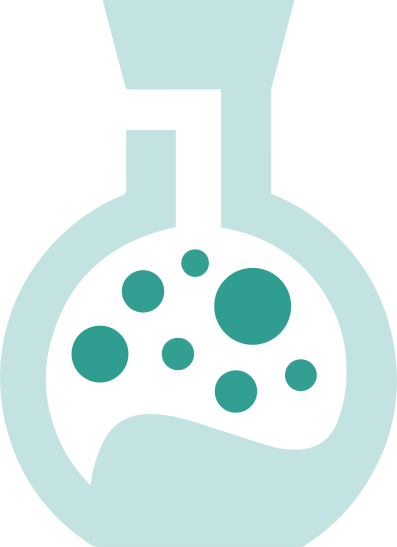

#  Sandbox Science

**Sandbox Science** is an interactive platform designed to make learning and exploring scientific concepts fun and accessible. The platform offers a variety of simulations, from cellular automata like Game of Life to complex particle interactions in Particle Life, allowing users to dive deep into the fascinating world of science through hands-on, visual experiences.

---

## 🚀 Features

- **Game of Life**: Explore cellular automata and understand the basics of computational biology.
- **Particle Life**: Simulate and observe the behavior of particle systems.
- **More Simulations**: Dive into various scientific simulations, with more being added regularly.

## 🎯 Goals

Sandbox Science aims to:

- Make complex scientific concepts easier to understand through visual and interactive experiences.
- Provide an open platform where science enthusiasts can explore, learn, and contribute.
- Encourage collaboration and community-driven development.

## 🛠 Installation

To run Sandbox Science locally, follow these steps:

1. **Clone the repository:**
   ```bash
   git clone https://github.com/DicSo92/SandboxScience.git
   cd sandbox-science
   ```

2. **Install dependencies:**
   ```bash
   npm install
   ```

3. **Run the development server:**
   ```bash
   npm run dev
   ```

4. **Open your browser:**
   Visit http://localhost:3000 to explore the site locally.

## 📦 Build

To build the project for production, use the following command:

```bash
npm run build
```

This will create an optimized version of the project in the \`dist\` directory, ready for deployment.

## 🤝 Contributing

We are excited to open-source Sandbox Science soon and welcome contributions from the community. Here’s how you can get involved:

1. **Fork the repository**
2. **Create a new branch**
   ```bash
   git checkout -b feature/YourFeatureName
   ```
3. **Make your changes**
4. **Submit a pull request**

Please ensure your changes adhere to our [contribution guidelines](CONTRIBUTING.md) and respect the project's code of conduct.

## 💬 Community & Support

Join our [Discord community](https://discord.com/invite/z5yuzkFpCA) to share feedback, suggest new features, and engage with other science enthusiasts. Your insights and contributions help us improve Sandbox Science.

## 📜 License

This project is licensed under the [GNU Affero General Public License v3.0 (AGPL-3.0)](LICENSE). You can use, modify, and distribute the software, but modifications must also be shared under AGPL-3.0. See the [LICENSE](LICENSE) file for more details.

## 🌟 Acknowledgments

- Thanks to everyone who has contributed to this project.
- Special thanks to the open-source community for their continuous support and inspiration.
